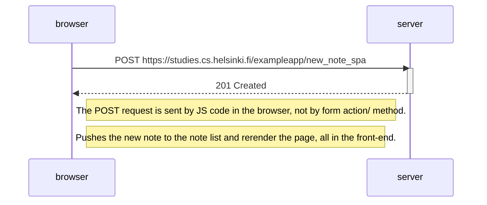

- Sequence diagram for the chain of events caused by creating a new note on: https://studies.cs.helsinki.fi/exampleapp/spa
- The process happens without any redirect or refresh of the whole page.

```mermaid
sequenceDiagram
    participant browser
    participant server

    browser->>server: POST https://studies.cs.helsinki.fi/exampleapp/new_note_spa
    activate server
    server-->>browser: 201 Created
    deactivate server
    Note right of browser: The POST request is sent by JS code in the browser, not by form action/ method.
    Note right of browser: Pushes the new note to the note list and rerender the page, all in the front-end.
```
